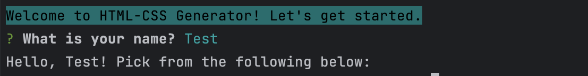

# HTML/CSS Generator

## Inspiration
<aside>
🛗I was driving in the car on the way to work, and I came across a youtube channel that talked about envisioning your life and the kind of work you want to be doing. A few things came to mind, and it made me feel as intended - *happy and content*.

The next thing that came to mind was this very idea - creating a product that generates/retrieves UI & UX components and other bits of starter code so that you don’t have to keep looking around for that bit of code you saved from some time ago.
This product can save you some minor inconvenience (you know - those times where you look at your screen with dread because you don’t want to have to write that form for the *13th* time) and can help you get to the portion of your work where you’re solving problems unique to you and your code.

</aside>

## Getting Started

- Make sure node is installed
- This uses ts-node, so you must build first
```
npm run build
```

- Run the following
```
node dist/index.js
```
You should be prompted with the welcome message


